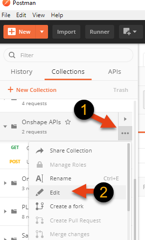
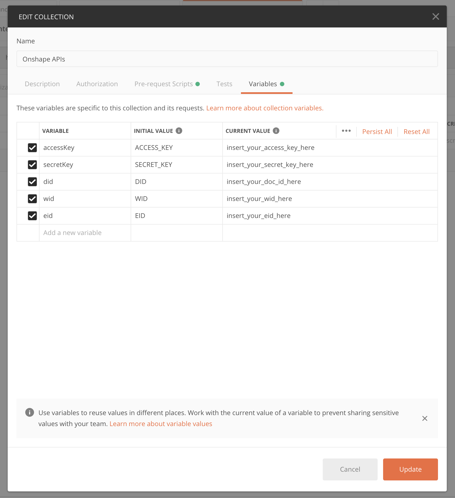

# Authenticating with Postman

Postman is a great way to quickly test all aspects of the API - from authentication to response bodies,
to accepted params, etc... Postman supports the Onshape OAuth2.0 authentication out of the box. 
With a little tweaking, Postman can also support API key authentication.

## API Key Authentication
 
How to setup Postman to correctly sign API requests:
1. File->Import-> select this file: [Onshape Postman Collection.](./onshape.postman_collection.json).
1. Now make and keep handy your secret key and access key from the [Onshape Dev Portal](https://dev-portal.onshape.com/).
1. Add the environment variables `accessKey` and `secretKey` to the collection as seen here:

or alternatively in a [Postman Environment](https://learning.postman.com/docs/postman/variables-and-environments/variables/#environments-in-postman)
1. Now try running one of the calls in the collection. 

The Collection is using a [pre-script](https://learning.postman.com/docs/postman/scripts/pre-request-scripts/) 
to generate the necessary auth headers and [variables](https://learning.postman.com/docs/postman/variables-and-environments/variables/) 
to make calls more reusable. 

Let us know via 'issues' in this repo if you run into any issues.