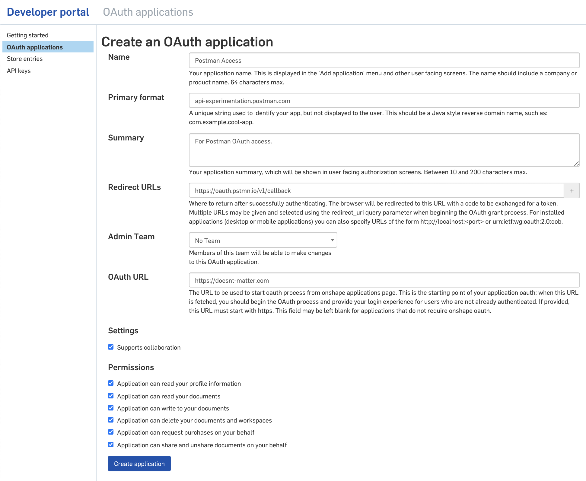

# Authenticating with Postman

Postman is a great way to quickly test all aspects of the API - from authentication to response bodies,
to accepted params, etc... Postman supports the Onshape OAuth2.0 authentication out of the box. 
With a little tweaking, Postman can also support API key authentication.

## Import
 
1. Importing collection: Import->Link-> select this link: [https://www.postman.com/collections/8c1af83901556a2c0695](https://www.postman.com/collections/8c1af83901556a2c0695).
1. Importing the production environment: Import->Link-> select this link:[https://raw.githubusercontent.com/onshape-public/onshape-clients/postman/postman/onshape-production.postman_environment.json](https://raw.githubusercontent.com/onshape-public/onshape-clients/postman/postman/onshape-production.postman_environment.json).

## OAuth 2

1. Make sure you followed [Import](#import)
1. Make an OAuth app and keep your clientId and clientSecret from here: [Onshape Dev Portal Create New OAuth Application](https://dev-portal.onshape.com/oauthApps/createNew). Check all the scopes and make sure to include `https://oauth.pstmn.io/v1/callback` in the "OAuth redirect (callback) URLs
" as seen here: 
1. Edit the imported environment variables' clientId and clientSecret current value column to include the values you got from step 2. 
1. Edit the collection, and go to 'Authorization' tab and select OAuth 2.0. Then select 'Get Access Token' near the bottom of the form. You should be directed successfully through the OAuth flow, which requires you to sign into Onshape from the browser. You will be redirected to Postman with the token, at which point you can hit `Use Token`.
1. Now try making a request. The token expires every hour, so you will have to re-fetch it every so often by following the previous step again.

Let us know via 'issues' in this repo if you run into any issues.

## API Keys

**(ATTN: [OAuth 2](#oauth-2) is recommended over this method of authentication)**

The collection has a pre-request script that builds the correct headers from the request in order to correctly authenticate against the server. 

Current limitations:
* multipart/form-data requests don't work with this method.

Instructions:

1. Make sure you followed [Import](#import)
1. Make and keep handy your secret key and access key from the [Onshape Dev Portal](https://dev-portal.onshape.com/keys/createkey).
1. Edit the environment to include your access and secret key from step 1 in the 'current value' location of the environment settings for the `accessKey` and `secretKey` variables.
1. Edit the collection and set the Authorization to 'none' if it isn't already. Confusingly, 'none' in this context means API-keys because the collection has a script that automatically appends the authentication headers.
1. Now try running one of the calls in the collection. 

The Collection is using a [pre-script](https://learning.postman.com/docs/postman/scripts/pre-request-scripts/) 
to generate the necessary auth headers and [variables](https://learning.postman.com/docs/postman/variables-and-environments/variables/) 
to make calls more reusable. 
